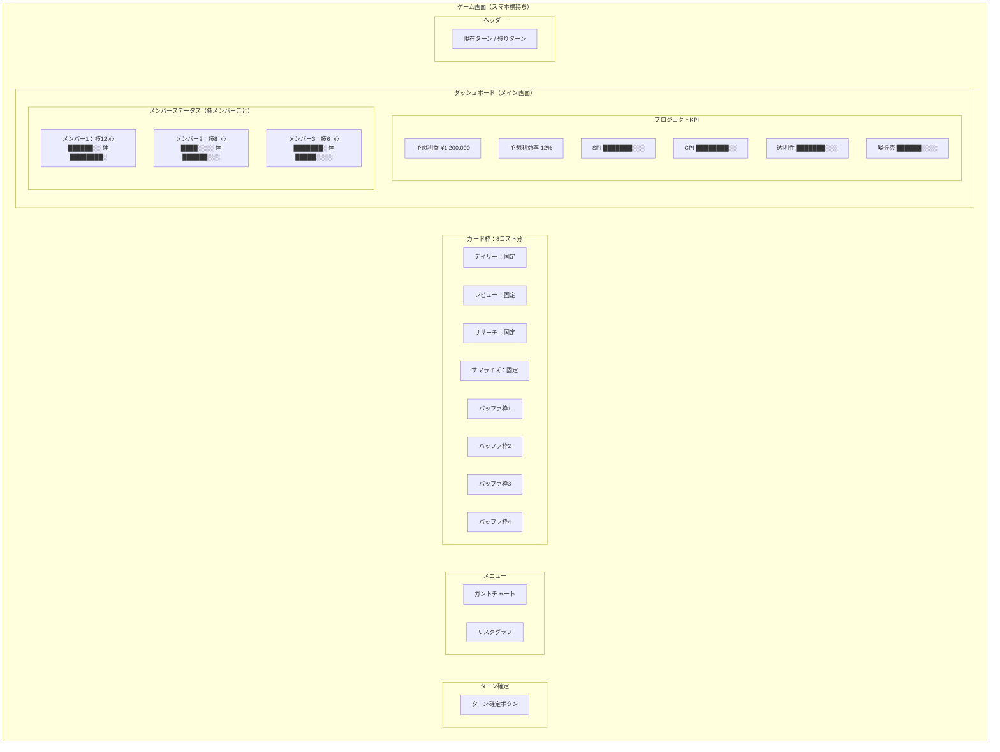

# 画面構成

## ツール

使用できるツールはガントチャート・PERT図・EVM・リスクグラフの4種類。

- いずれも閲覧専用（状態確認用のビューアー）であり、プレイヤーが直接編集することはない
- ガントチャート／PERT図の内容を更新できるのは「リスケ」カードの効果、
  または仕様追加イベントの発生時のみ（いずれも事前作成データへの差し替えで反映）
- リスクグラフは、ランダムイベントの発生確率をイベントカテゴリ
  （進捗ダウン・進捗アップ・メンバー稼働系・スコープ変化系・バフ系・デバフ系）に分解し、
  レーダーチャート（N角形）で表示するもの。現在時点のスナップショット表示。
  詳細は [イベント](../03-詳細設計/イベント.md) の「発生確率の可視化（リスクグラフ）」を参照

## ゲーム画面の構成案

スマートフォン横持ちを前提とした画面設計。
常時表示できる情報量に限りがあるため、
ダッシュボード（メイン画面）にはKPIとメンバーステータスのみ表示し、
他の詳細はメニューから画面切替で表示する。

### 画面構造の概要

| エリア | 表示内容 | 常時/切替 |
|--------|----------|-----------|
| ヘッダー | 現在ターン / 残りターン | 常時 |
| ダッシュボード | プロジェクトKPI・メンバーステータス | 常時（メイン画面） |
| カード枠 | 8コスト分のカードスロット | 常時（画面下部） |
| メニュー | 各画面への切替ナビゲーション | 常時 |
| フッター | ターン確定ボタン | 常時 |

### メニューから切替可能な画面

| 画面 | 表示内容 |
|------|----------|
| ガントチャート | スケジュール・依存関係の確認 |
| リスクグラフ | リスクレーダーチャート |

- PERT図は独立したビューとしては持たない。
  ガントチャートの各タスクから依存タスクをたどる形で確認できる扱いとする

### 画面レイアウト

### レイアウト方針

- ダッシュボードにプロジェクトKPI（7指標）とメンバーステータスを常時表示する。
  スマホ横持ちの限られた画面領域で「全体感の把握」を最優先とする。
  KPI表示形式は指標ごとに異なる。
  予想利益・予想利益率は数値のみ表示。
  SPI・CPI・透明性・緊張感は横棒ゲージ（ライフバー形式）で表示する。
  ゲージ系の指標は「値が高い＝良い状態」に統一し、直感的に読み取れるようにする
- メンバーステータスはメンバーごとに技・心・体を表示する。
  技は数値表示、心・体は横棒ゲージ表示
- カード枠（8コスト分）は画面下部に常時表示する。
  毎ターンのアクション選択がメイン操作であるため、
  画面切替なしでカードを配置できるようにする。
  カード枠のうち4枠はデイリー・レビュー・リサーチ・サマライズが初期配置、
  残り4枠はバッファ（空き）。全8枠いずれもカードの置き換えが可能。
  カードを置いた際にサブアクションや対象の選択が発生する場合がある。
  大コストのカード（例：16コスト）を置くと複数枠を占有し、
  他のカードが強制的にどかされる。
  さらに翌ターン以降も枠を占有し続け、どかせないカードとなる（ロック状態）
- メニューから画面切替で詳細を表示する。
  切替先はガントチャート画面・リスクグラフ画面の2つ
- ガントチャート画面：スケジュールと依存関係の確認。
  タスク選択から依存タスク（PERT的な情報）も確認できる
- リスクグラフ画面：リスクレーダーチャートを表示
- イベント発生はガントチャートを直接変化させるのではなく、
  プロジェクトまたはメンバーに「状態変化」を付与する
  （ただし仕様追加イベントとリスケカードは事前作成データへの差し替えでガントチャートを更新する）。
  メンバーステータスにはこの状態変化が反映される
- ターン確定は常時表示の固定ボタン
- 具体的な画面遷移（ステージセレクト画面など）は今後別途整理する

### ゲージ系パラメータの共通仕様

プロジェクトKPIの透明性・緊張感と、メンバーの心は同じ仕組みで動く。

| パラメータ | 初期値 | 範囲 | 低すぎると | 高すぎると |
|-----------|--------|------|-----------|-----------|
| 透明性 | 100 | 0〜150 | 情報が隠蔽され判断材料が不足する | 情報過多で要点が埋もれる |
| 緊張感 | 100 | 0〜150 | 弛緩し危機感が失われる | ギスギスし関係が悪化する |
| 心 | 100 | 0〜150 | 不安定になり消極的になる | 慢心し注意力が低下する |
| 体 | 100 | 0〜100 | 疲弊しパフォーマンスが落ちる | （100を超えない） |

変動要因は今後設計（カード効果・イベント・ターン経過など）。

透明性・緊張感・心は、単純に「上げれば良い」ではなく
中間的なバランスを維持する判断が求められる。
ただし表示上は「高い＝良い」のゲージとして見せる
（高すぎ領域に入ったことはイベント発生時に初めて分かる設計）。
体は100が最大値で、下がることのみがリスクとなる。

## ターン移行ロード画面

ターン確定ボタン押下後、次ターンの状態が確定するまでの処理待ち時間に
ロード画面を表示する。この画面にはプロジェクトマネジメントの専門用語解説を掲出し、
待ち時間を学習機会として活用する。

### 表示仕様

| 項目 | 内容 |
|------|------|
| 表示タイミング | ターン確定ボタン押下〜次ターン開始画面表示までの間 |
| 表示内容 | PM用語の名称＋1〜2文の解説 |
| 選出ロジック | ランダム（同一プレイ中の重複を避ける） |
| 表示例 | 「EVM（アーンド・バリュー・マネジメント）：計画値・出来高・実コストの3指標で進捗とコストを同時に測る手法。」 |

### 用語プールの方針

- ゲーム内で実際に登場する概念を優先する
  （EVM、SPI、CPI、クリティカルパス、WBS、リスクマトリクス、バッファ管理など）
- ゲーム内要素との対応を添えると理解が深まる
  （例：「SPI — ゲーム内のガントチャート進捗率と連動しています」）
- プレイヤーの学習進度に応じた段階分けは初期実装では行わない（将来拡張の余地あり）

### レイアウト

ロード画面中央にアニメーション（進行中を示すインジケータ）を配置し、
その下に用語解説テキストを表示する。
処理が短時間で完了した場合でも最低1秒は表示し、読み取れるようにする
