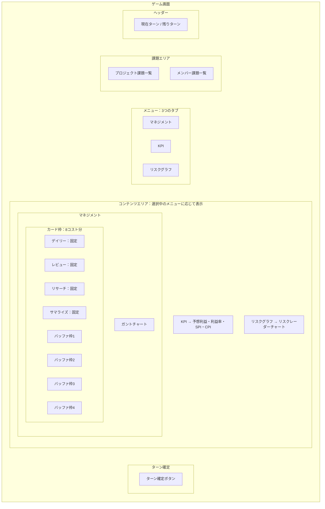

# 画面構成

## ツール

使用できるツールはガントチャート・PERT図・EVM・リスクグラフの4種類。

- いずれも閲覧専用（状態確認用のビューアー）であり、プレイヤーが直接編集することはない
- ガントチャート／PERT図の内容を更新できるのは「リスケ」のような専用カードの効果のみ
- リスクグラフは、ランダムイベントの発生確率をイベントカテゴリ
  （進捗ダウン・進捗アップ・メンバー稼働系・スコープ変化系・バフ系・デバフ系）に分解し、
  レーダーチャート（N角形）で表示するもの。現在時点のスナップショット表示。
  詳細は [イベント](../03-詳細設計/イベント.md) の「発生確率の可視化（リスクグラフ）」を参照

## ゲーム画面の構成案

PMが判断に必要な情報を重要度順に配置する。
上から順に「まず数字で全体感をつかみ、次に課題を確認し、
最後に詳細スケジュールを見る」という視線の流れを想定する。

### 画面構造の概要

| エリア | 表示内容 | 常時/切替 |
|--------|----------|-----------|
| ヘッダー | 現在ターン / 残りターン | 常時 |
| 課題エリア | プロジェクト課題一覧・メンバー課題一覧 | 常時 |
| メニュー | マネジメント / KPI / リスクグラフ | 常時（タブ選択） |
| コンテンツ | 選択メニューに応じた詳細表示 | 切替 |
| フッター | ターン確定ボタン | 常時 |

- PERT図は独立したビューとしては持たない。
  ガントチャートの各タスクから依存タスクをたどる形で確認できる扱いとする

### 画面レイアウト

### レイアウト方針

- ヘッダー直下に課題エリアを常時表示し、問題の有無を最初に把握できるようにする。
  イベント発生はガントチャートを直接変化させるのではなく、
  プロジェクトまたはメンバーに「状態変化」を付与する。
  課題エリアにはこの状態変化を表示することで課題を俯瞰できる構造とする
- メニューは「マネジメント」「KPI」「リスクグラフ」の3つ。
  コンテンツエリアの表示が切り替わる
- マネジメント：上部にカード枠（8コスト分）、下部にガントチャート。
  カード枠のうち4枠はデイリー・レビュー・リサーチ・サマライズが初期配置、
  残り4枠はバッファ（空き）。全8枠いずれもカードの置き換えが可能。
  カードを置いた際にサブアクションや対象の選択が発生する場合がある。
  大コストのカード（例：16コスト）を置くと複数枠を占有し、
  他のカードが強制的にどかされる。
  さらに翌ターン以降も枠を占有し続け、どかせないカードとなる（ロック状態）。
  ガントチャートのタスク選択から依存タスク（PERT的な情報）も確認できる
- KPI：予想利益・予想利益率・SPI・CPIを表示
- リスクグラフ：リスクレーダーチャートを表示
- ターン確定は常時表示の固定ボタン
- 具体的な画面遷移（ステージセレクト画面など）は今後別途整理する
