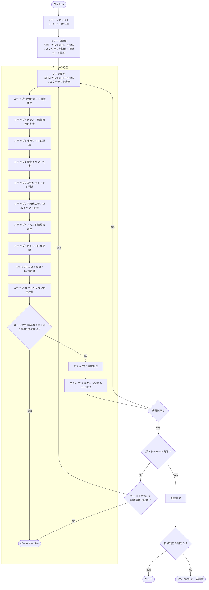

# ターン処理フロー

## 1ターンの処理順序

1ターン（1日）の終了時、次の順序で状態を確定させ、
次ターン開始時点のガントチャート・PERT図・EVM・リスクグラフに反映する。

1. PMのカード選択確定。カード使用分のコストを消費し、
   対象（PM自身・メンバー）に状態をセット／解除する
2. メンバー稼働可否の判定。リスクグラフの現在の確率カテゴリ（メンバー稼働系）に基づき、
   体調不良などメンバー稼働系のランダムイベントをここで先に抽選し、
   当日稼働できるメンバーを確定する。
   離脱・応援要員は条件付きイベントのためここでは抽選しない（ステップ5で判定）。
   抽選確率に心の状態を用いる場合は、前日終了時点（当日の変動前）の値を使う
3. メンバー行動の確定。心・体の日次変動を反映したうえで、稼働可能なメンバーについて
   技・体をベースにした進捗ダイスを計算する
   （計算方法は [進捗ダイスと経験値](./進捗ダイスと経験値.md) を参照）。
   稼働不可のメンバーはこの日のダイスを振らない
4. 固定イベント判定。当日がキックオフ・デイリー・週次進捗会議・締め・クロージングの
   いずれかに該当するかを判定する
5. 条件付きイベント判定。当ターンに判定対象の条件付きイベントがあるか確認し、
   あれば条件式を評価する。条件を満たせば発生キューに追加、満たさなければ永久に消滅する。
   条件付きイベントの詳細は [イベント](./イベント.md) の「条件付きイベント」を参照
6. その他のランダムイベント抽選。リスクグラフの現在の確率カテゴリに基づき、
   メンバー稼働系以外（進捗ダウン／進捗アップ、バフ系、デバフ系など）
   のイベントを抽選する
7. イベント結果の適用。手戻り・停滞の発生、パラメータ変動、新規タスク追加などを確定させる。
   条件付きイベントの結果もここで一括適用する
8. ガントチャート／PERT図の更新。進捗率の反映、後続タスクへの波及を計算する。
   仕様追加イベントやリスケカードによる構造変更は、事前作成データへの差し替えで反映する。
   進捗率の反映に加味するランダムイベントは「進捗ダウン」「進捗アップ」カテゴリのものに限る
   （カテゴリの詳細は [イベント](./イベント.md) の
   「イベントカテゴリ（ガントチャート計算との対応）」を参照）
9. コスト集計。ベースライン消費・PMの行動コスト・追加事象コストを合算し、
   EVM（PV/EV/AC）を更新する
10. リスクグラフの再計算。更新後の状態から発生確率カテゴリを算出し直す
11. 失敗条件チェック。総消費コストが予算の100%を超えていないか、
    納期到達時にガントチャートが未完了でないかを確認する
    （詳細は [要件定義](../01-要件定義/index.md) の「失敗条件」を参照）
12. 週次処理。5ターン（稼働日）経過ごとの週休2日回復、週次進捗会議の該当判定を行う
13. 次ターンの配布カードを決定する
14. 更新後の状態を次ターン開始時点のガントチャート・PERT図・EVM・リスクグラフとして表示する

## ゲームの流れ（全体図）

ステージ選択からクリア／失敗までの全体フロー。
ターン処理フローの14ステップは、図中では要約して1周分のループとして表す。

「目標利益を超えなかった場合」の扱い（失敗と同じ扱いにするか、別のランクにするか）は未決定のままなので、
図中では「クリアならず・要検討」としている。
